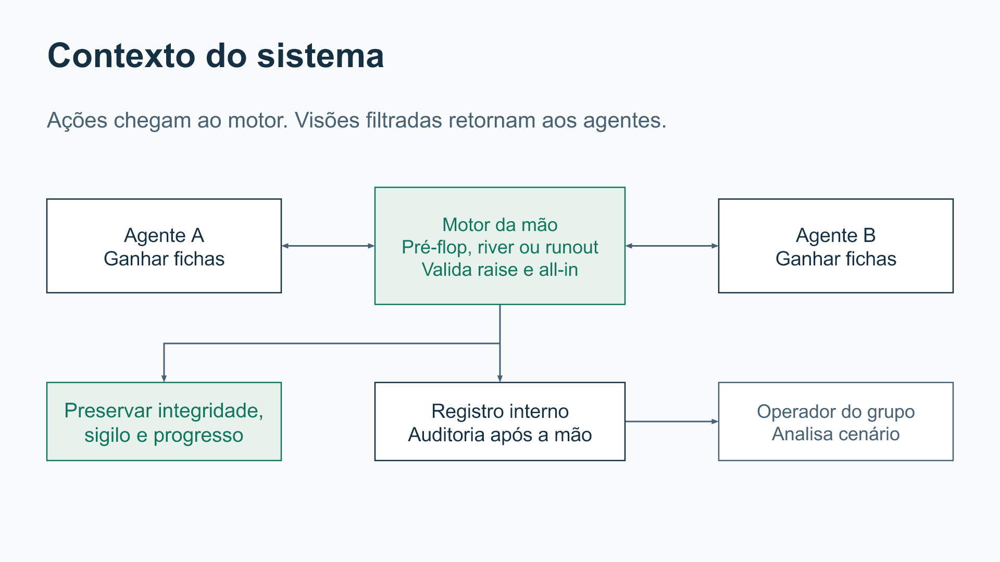
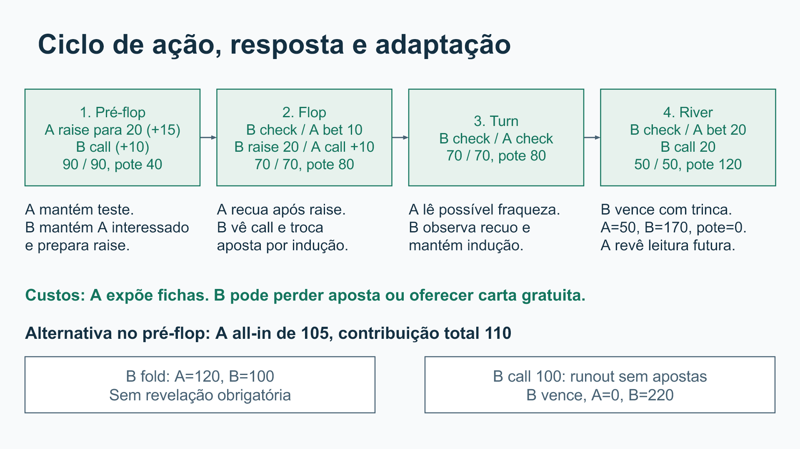
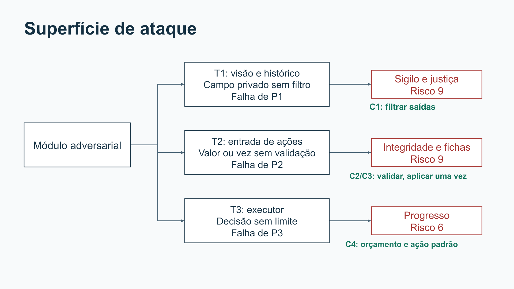

# Poker Adversarial

**Trabalho 1 — Análise de um Sistema Adversarial**

**Disciplina:** Engenharia de Software Adversarial · **Grupo:** 7

| Integrante | E-mail institucional |
|---|---|
| Rafael Barboza Torres | rafaelbarbozarafaelbarboza.aluno@unipampa.edu.br |
| Elton Henrique Lunardi Gimenes | eltongimenes.aluno@unipampa.edu.br |
| Frederico Marques da Silva Barcelos | fredericobarcelos.aluno@unipampa.edu.br |
| Diego Santos de Araujo | diegoaraujo.aluno@unipampa.edu.br |

## Materiais da entrega

| Material | Acesso |
|---|---|
| Relatório principal | Este README |
| Apresentação em slides | [PDF](apresentacao/slides.pdf) · [PPTX editável](apresentacao/slides.pptx) |
| Diagramas | Imagens nas seções 2.4, 4.2 e 5.1; arquivos Mermaid junto de cada imagem e [fonte visual editável em PPTX](diagramas/diagramas-editaveis.pptx) |
| Referências completas | [Referências e rastreabilidade](fontes/referencias.md) |
| Link do vídeo no YouTube | | [Vídeo YouTube]([https://youtu.be/EUSP9QfMzbk]) |

## Resumo

Este relatório analisa uma mão de poker entre dois agentes de software que disputam fichas virtuais sob informação parcial. A interação começa no pré-flop e admite check, bet, call, fold, raise e all-in. Um motor de jogo medeia a disputa, aplica as regras e fornece visões autorizadas. O objetivo dos agentes é maximizar o saldo final; as propriedades preservadas pelo sistema são integridade da mão, confidencialidade das cartas e progresso da execução.

A análise combina uma matriz estática 2×2 no river, quatro etapas conectadas de ação, resposta, observação e adaptação, e três cenários de ameaça associados à arquitetura. No jogo reduzido, B possui uma estratégia fracamente dominante e o único equilíbrio em estratégias puras é (A2, B1). No percurso dinâmico, A interpreta incorretamente o check de B e perde o blefe, mantendo-se a conservação das 220 fichas. Vazamento de cartas e aceitação de ações inválidas recebem risco 9; bloqueio da decisão recebe risco 6. O redesenho propõe filtragem de informações, validação central, aplicação única de ações, orçamento de execução e auditoria.

O trabalho apresenta planejamento e desenho arquitetural para a implementação no Trabalho 2. Os cenários são sintéticos e descritos manualmente; não há motor de jogo implementado nem resultados experimentais de eficácia dos controles.

## Sumário

1. [Proposta e delimitação](#1-proposta-e-delimitação)
2. [Descrição do sistema adversarial](#2-descrição-do-sistema-adversarial)
3. [Modelo estratégico estático](#3-modelo-estratégico-estático)
4. [Modelo estratégico dinâmico](#4-modelo-estratégico-dinâmico)
5. [Ameaças e riscos](#5-ameaças-e-riscos)
6. [Redesenho e resiliência](#6-redesenho-e-resiliência)
7. [Arquitetura inicial para o Trabalho 2](#7-arquitetura-inicial-para-o-trabalho-2)
8. [Conclusão e resposta à pergunta final](#8-conclusão-e-resposta-à-pergunta-final)
9. [Referências](#9-referências)
10. [Contribuições individuais](#10-contribuições-individuais)
11. [Declaração de uso de IA generativa](#11-declaração-de-uso-de-ia-generativa)

## 1. Proposta e delimitação

### 1.1 Interação analisada e regras

Usamos uma variante didática de Texas Hold'em No Limit: duas cartas privadas por agente, cinco comunitárias reveladas em etapas e comparação da melhor combinação de cinco cartas. Cartas, etapas, blinds e aumentos se apoiam nas [regras da PokerStars](https://www.pokerstars.com/poker/games/texas-holdem/). Mantemos uma única mão local, fichas inteiras e cenários sintéticos, sem torneio ou dinheiro real.

**O estado inicial é o pré-flop:** as cartas privadas foram distribuídas, mas nenhuma comunitária está aberta. A ocupa o botão/small blind, deposita 5 e age primeiro no pré-flop. B deposita o big blind de 10 e age primeiro no flop, turn e river. Os blinds contam como contribuições da etapa, não como apostas adicionais a pagar integralmente. No exemplo, cada agente tinha 110 antes dos blinds; a visão inicial contém A=105, B=100 e pote=15.

| Situação | Ações permitidas e resultado |
|---|---|
| Sem valor a pagar | Check ou bet de pelo menos 10 fichas, até o saldo disponível. Bet inicia uma aposta quando não há aposta aberta na etapa. |
| Com valor a pagar | Fold, call ou raise. Call transfere a diferença entre a maior contribuição da etapa e a contribuição própria, limitada pelo saldo. |
| Raise | Define o **total da contribuição na etapa**, não o valor adicional. O aumento deve ser pelo menos o último aumento completo, inicialmente 10. Contra bet de 10, raise para 20 transfere 20 se o agente ainda não contribuiu; o adversário já contribuiu 10 e paga apenas mais 10. Não há limite fixo de quantidade de raises, mas cada aumento consome fichas finitas. |
| All-in | Transfere todo o saldo. O motor classifica como bet, call total/parcial ou raise segundo a contribuição acumulada. Um all-in pode ficar abaixo do mínimo porque esgota o saldo. Um aumento incompleto não reabre apostas. Com somente dois agentes, o outro apenas paga ou desiste diante de um all-in que supera sua contribuição. |
| Pré-flop sem aumento | Se A completar o big blind, B ainda pode dar check ou raise. Igualar os blinds não encerra a etapa antes dessa oportunidade de B. |
| Fechamento normal da etapa | Ambos deram check, ou a última aposta/aumento foi pago e ambos tiveram oportunidade de agir. As contribuições da etapa são zeradas para a próxima etapa, mas o pote permanece. Abrem-se flop, turn e river na ordem. |
| All-in pago | Após a resposta pendente, o motor devolve a parte não coberta da contribuição maior. Sem novas decisões de aposta, revela as cartas privadas e abre as comunitárias restantes em ordem até a comparação final. Dois agentes não exigem pote paralelo. |
| Fold | O agente restante recebe o pote, incluindo suas fichas ainda nele. Não há revelação obrigatória de suas cartas e a mão termina. |
| River concluído sem fold | Revelam-se as cartas, compara-se a melhor mão e entrega-se o pote ao vencedor. Em empate, divide-se igualmente. Se houver ficha indivisível, ela fica com B, primeiro a agir após o flop, regra fixada antes da mão. |

O saldo nunca fica negativo. Um agente com saldo zero não recebe nova chamada de aposta. Aumentar contra um oponente já all-in não é permitido. O motor rejeita ações incompatíveis com a vez, etapa, saldo ou aumento mínimo sem alterar fichas. Valores devem ser inteiros; não ficam limitados a 10 e 20, usados apenas nos exemplos. Se um saldo inicial não cobre o blind, publica-se o valor efetivamente depositado, mantém-se 10 como referência mínima e resolve-se o all-in após a resposta legal do oponente, devolvendo eventual excesso.

O fluxo é: preparar cartas e blinds, fornecer visão autorizada, receber e validar ação, atualizar fichas e contribuição da etapa, publicar o evento e chamar o próximo agente. O motor acompanha maior contribuição, valor a pagar, último aumento completo e oportunidade de resposta. Cada atualização pública alimenta a decisão seguinte.

Antes da revelação permitida, a visão contém cartas próprias, comunitárias abertas, saldos, pote, posição, vez, contribuições da etapa, valor a pagar, mínimo de aumento, ações legais e histórico público. Não contém cartas futuras, cartas privadas do oponente ou sua justificativa interna. O runout após all-in pago libera as cartas segundo a regra de revelação, sem entregar antecipadamente o baralho inteiro.

### 1.2 Por que é adversarial?

Os objetivos são conflitantes: os agentes disputam o mesmo recurso e preferem aumentar seu saldo final. A aposta é um sinal intencional que pode tentar provocar uma desistência. Ao observar call ou check, o oponente adapta sua próxima decisão. A incerteza das cartas não elimina a intenção de influenciar o adversário.

Uma entrada inválida acidental é erro; enviar deliberadamente aposta ilegal para explorar validação ausente é ação adversarial. Um blefe válido é competição permitida. Conhecer cartas proibidas por vazamento viola a justiça. O motor medeia a disputa e não precisa derrotar um jogador.

### 1.3 Escopo para o Trabalho 2

**Incluído:** execução local, dois agentes configuráveis, uma mão desde o pré-flop com até quatro etapas, raise, all-in, devolução de excesso, dados sintéticos, visões filtradas, validação central, contabilização, encerramento por fold ou revelação, limite de execução e auditoria.

**Excluído:** torneios, dinheiro real, contas, plataforma online, agentes externos arbitrários, aprendizagem estatística, múltiplas mãos de treino e potes paralelos com três ou mais jogadores.

Os agentes são módulos do próprio protótipo. O motor é a autoridade sobre cartas e fichas. Para controlar uma decisão que não termina, o executor deverá rodar o módulo em processo separado, recebendo apenas a visão serializada. Isso permite encerrar a chamada sem travar o motor, mas não constitui sandbox para código externo não confiável. Essa modalidade exigiria proteção adicional e fica fora do recorte.

## 2. Descrição do sistema adversarial

### 2.1 Atores, objetivos e capacidades

| Ator | Objetivo | Ações e capacidades | Informação observável | Restrições e custos |
|---|---|---|---|---|
| Agente A | Maximizar fichas ao final da mão | Check, bet, call, fold, raise, all-in e mudança de política de pressão | Cartas próprias, comunitárias abertas, pote, saldos, vez e ações públicas de B | Saldo finito, aumento mínimo, informação parcial e apostas perdidas |
| Agente B | Maximizar fichas ao final da mão | Mesmas ações; mudar de apostar por valor para induzir apostas | Visão autorizada equivalente e ações públicas de A | Pagar para observar, deixar de ganhar por cautela e errar sinais |
| Motor e executor | Preservar regras, fichas, sigilo e progresso | Preparar, filtrar, validar, atualizar, encerrar chamadas e distribuir pote | Estado completo, ações recebidas e eventos | Não entregar sua visão completa ao agente; controles têm custo e podem falhar |
| Operadores do grupo | Configurar e analisar cenários | Definir entradas e revisar auditoria após a mão | Visão completa para análise, separada das entradas dos agentes | Não orientar um agente com dados privados do outro durante a decisão |

### 2.2 Ativos e propriedades

O ativo principal é a **integridade da mão**, incluindo transições legais e conservação de fichas. Cartas privadas precisam de **confidencialidade**, e a interação precisa de **progresso**. Justiça significa aplicar regras e autorizações equivalentes aos agentes, sem garantir que ambos ganhem.

A verificação planejada confere, após cada evento, que saldo de A + saldo de B + pote = total inicial; compara ações aceitas com a vez e a lista legal; procura cartas proibidas em todas as visões e históricos públicos; e confere encerramento dentro do orçamento. O exemplo possui 220 fichas.

### 2.3 Pressupostos e possíveis falhas

| ID | Pressuposto | Como pode falhar | Consequência |
|---|---|---|---|
| P1 | Cada agente recebe somente dados autorizados | Serialização inclui cartas do outro, futuras ou justificativas privadas na visão/histórico | Vantagem informacional e violação de sigilo, ligada a T1 |
| P2 | Motor é a única autoridade para aceitar e contabilizar | Confia na mensagem sem conferir vez, formato, saldo ou limites | Ação ilegal altera fichas ou sequência, ligada a T2 |
| P3 | Decisão termina ou é interrompida | Executor espera indefinidamente um módulo sem retorno | Mão bloqueada, ligada a T3 |
| P4 | Entradas têm cartas únicas e estado coerente | Cartas duplicadas ou saldos incompatíveis entram no cenário | Comparação ou contabilização inválida, mesmo sem intenção adversarial |

### 2.4 Diagrama de contexto

Fonte editável: [Mermaid](diagramas/contexto.mmd). Os agentes cruzam a fronteira apenas por visões autorizadas e propostas de ação. O operador analisa a auditoria sem transformá-la em entrada indevida durante a decisão.

## 3. Modelo estratégico estático

### 3.1 Decisão central e limites

Analisamos retrospectivamente uma decisão no river, após o check inicial de B: pote de 80 e aposta de 20, com as cartas fixadas no exemplo da seção 4. Se houver revelação, B vence. O analista conhece os resultados possíveis e constrói um jogo reduzido de informação completa. Os agentes da interação continuam sem conhecer as cartas do outro.

O equilíbrio pertence à tabela. Não determina a decisão ótima sob informação parcial, que exigiria crenças sobre mãos possíveis e outra modelagem. As colunas são políticas condicionais, evitando call ou fold sem aposta:

- **A1:** bet de 20 como blefe.
- **A2:** check após o check inicial de B e revelação.
- **B1:** pagar se A apostar; seguir para revelação após check.
- **B2:** desistir se A apostar; seguir para revelação após check.

O check inicial de B é fixado como condição desta matriz 2×2. Raises e all-in de ambos foram excluídos somente da tabela reduzida, mas continuam nas regras gerais. B1/B2 descrevem a resposta de B ao bet de A; não são ações adicionais depois de check/check. Procurar melhores respostas e seus cruzamentos segue o método apresentado na [aula 2 de Teoria dos Jogos do MIT](https://ocw.mit.edu/courses/17-810-game-theory-spring-2021/mit17_810s21_lec2.pdf).

### 3.2 Fichas e preferências

O ganho líquido considera este ponto de decisão, excluindo contribuições anteriores já colocadas no pote:

| A / política de B | B1: pagar se houver aposta | B2: desistir se houver aposta |
|---|---:|---:|
| A1: apostar 20 | (-20, +100) | (+80, 0) |
| A2: check | (0, +80) | (0, +80) |

Com call, o pote chega a 120. B recebe 120 após investir 20, ganhando 100 desse ponto em diante; A perde 20 adicionais. Com fold, A recupera sua aposta e recebe o pote prévio de 80. A soma dos ganhos dessa comparação é 80, recurso já existente no início da decisão. Considerando toda a mão, ganhos relativos ao saldo anterior de 110 são de soma zero.

Convertendo para preferências ordinais, na ordem **(payoff de A, payoff de B)**:

| A / política de B | B1 | B2 |
|---|---:|---:|
| **A1** | **(0, 3)** | **(3, 0)** |
| **A2** | **(1, 2)** | **(1, 2)** |

Para A, +80 é melhor que zero, que é melhor que -20. Para B, +100 é melhor que +80, que é melhor que zero. Valores maiores indicam preferência, não probabilidade. Não é necessário usar todos os números da escala para cada jogador.

### 3.3 Resultados, respostas e equilíbrio

| Resultado | Justificativa |
|---|---|
| (A1, B1) | O blefe recebe call e perde. Pior resultado de A e melhor de B entre as opções. |
| (A1, B2) | A provoca fold e conquista o pote. Melhor de A e pior de B. |
| (A2, B1) | B vence sem custo adicional. A evita perder mais, mas não ganha. |
| (A2, B2) | A política de desistir só se aplica diante de aposta; com check, há a mesma revelação. |

| Escolha fixada | Melhor resposta | Comparação |
|---|---|---|
| B escolhe B1 | A2 | 1 > 0 para A |
| B escolhe B2 | A1 | 3 > 1 para A |
| A escolhe A1 | B1 | 3 > 0 para B |
| A escolhe A2 | B1 e B2 | Ambas dão 2 para B |

A não possui estratégia dominante. B1 domina **fracamente** B2: é melhor diante de A1 e igual diante de A2. Não há dominância estrita.

O único equilíbrio em estratégias puras é **(A2, B1)**. A perde preferência se muda sozinho para A1 e B não melhora mudando para B2. (A2, B2) não é equilíbrio porque A melhora apostando. Nas outras células também existe desvio unilateral lucrativo.

Esse resultado usa ações legais e conserva fichas. Justiça e sigilo dependem da arquitetura. O equilíbrio favorece B no cenário, sem garantir benefício igual aos participantes. Não analisamos estratégias mistas. No modelo dinâmico, A escolhe fora desse equilíbrio retrospectivo por interpretar incorretamente um sinal sob informação parcial.

## 4. Modelo estratégico dinâmico

### 4.1 Dados sintéticos e rodadas

Cada agente dispõe de 110 fichas antes dos blinds. A deposita 5 e B, 10; o pré-flop começa com **A=105, B=100 e pote=15**, sem comunitárias abertas. Total: 220 fichas. As cartas abaixo são sintéticas e não se repetem:

| Elemento | Cartas |
|---|---|
| Privadas de A | 7♣ e 2♦ |
| Privadas de B | A♥ e A♦ |
| Flop | A♠, 9♥, 4♣ |
| Turn | K♣ |
| River | 3♦ |

O analista vê toda a tabela; os agentes recebem apenas as cartas permitidas em cada etapa. B começa com par de ases e forma trinca no flop. Na revelação, sua melhor mão é A♥, A♦, A♠, K♣, 9♥. A possui A♠, K♣, 9♥, 7♣, 4♣, carta alta. A classificação segue a [hierarquia de mãos](https://www.pokerstars.com/poker/games/rules/hand-rankings/).

Política inicial de A: testar pressão pequena com mão fraca e ajustar pela resposta. Política inicial de B: valorizar mão forte com aposta ou raise; ao observar iniciativa de A, pode pagar para mantê-lo interessado ou dar check para induzir aposta. São heurísticas limitadas, sem demonstração de ótimo ou aprendizagem estatística. As comunitárias futuras não entram nessas decisões.

| Rodada | Ação e resposta | Observação e adaptação de A | Observação e adaptação de B | Estado ao fechar a etapa |
|---|---|---|---|---|
| 1 - pré-flop | A aumenta para 20, transferindo 15; B paga mais 10. Motor valida e abre o flop. | Vê call sem novo aumento e mantém pressão pequena como teste no flop. O call não revela as cartas de B. | Vê a iniciativa de A e paga, em vez de re-aumentar com seu par forte, para mantê-lo interessado. Se A insistir após o flop e B continuar forte, passa a aumentar por valor. | A=90, B=90, pote=40 |
| 2 - flop | B dá check; A aposta 10; B aumenta para 20; A paga mais 10. | Observa raise e paga mais 10 para continuar, sem afirmar que é uma decisão ótima. Troca pressão por cautela e planeja check se B não apostar no turn. | Após o check inicial, vê A insistir e aumenta com trinca. O call de A mostra interesse em continuar. Muda da política de apostar com mão forte no turn para check, tentando induzir nova aposta. | A=70, B=70, pote=80 |
| 3 - turn | B dá check; A dá check. Motor abre o river. | Mantém cautela nesta etapa após o raise do flop. Ao observar ausência de nova aposta de B, interpreta possível fraqueza e prepara blefe de 20 no river. | Executa check no lugar da aposta que sua política anterior escolheria. Observa check de A, mantém a tentativa de indução no river e planeja pagar se A voltar a pressionar e sua mão continuar forte. | A=70, B=70, pote=80 |
| 4 - river | B dá check; A blefa 20; B paga 20. Motor conduz à revelação. | O check repetido dispara o blefe. Call e revelação mostram que sua leitura falhou; pode reduzir esse blefe numa interação futura. | Mantém check para induzir, vê a retomada da pressão e paga. A revelação confirma um blefe neste caso, sem generalizar. | A=50, B=50, pote=120 |

B recebe 120 no encerramento: **A=50, B=170 e pote=0**. A soma é sempre 220. Os [dados estruturados](dados/cenario.json) registram cada transferência, o total da contribuição em raises, os estados esperados e as mudanças privadas de política.

A sequência é uma hipótese manual coerente, não resultado de simulador implementado. No river, após o check inicial de B, ocorre (A1, B1), fora do equilíbrio da tabela: A desconhece a mão de B e sua heurística erra a leitura do check. As quatro etapas preservam pelo menos três ciclos conectados de ação, resposta, observação e adaptação.

### 4.2 Ciclo e custos

Fonte editável: [Mermaid](diagramas/ciclo-adaptativo.mmd).

B explicita adaptação: sem a iniciativa de A e seu call ao raise do flop, apostaria no turn com mão forte; depois de observá-los, escolhe check para tentar induzir aposta. Seu custo é perder oportunidade de ganho ou permitir que a próxima carta favoreça A. A expõe fichas ao interpretar um sinal ambíguo.

No Trabalho 2, cada decisão deverá registrar internamente observação relevante, política anterior, política atual, ação e custo. O oponente não recebe esse registro. Controles técnicos também custam: interromper decisão legítima lenta pode provocar fold automático.

### 4.3 Perguntas de fechamento

- **Quem observa quem?** A e B observam ações públicas mútuas. Motor observa ações e execução. Operadores analisam auditoria após a mão.
- **O que muda?** A muda pressão e cautela. B muda de aposta por valor para indução. Regras e cartas não mudam por vontade do agente.
- **O que dispara adaptação?** Call, check, raise, all-in, valor, novas comunitárias e revelação. São sinais, não acesso garantido à força privada.
- **Qual é o custo?** Fichas comprometidas, oportunidade perdida, cálculo adicional e leitura errada. Defesa técnica pode interromper agente legítimo.
- **Onde surge corrida armamentista?** Mais pressão pode levar a mais pagamentos e exposição. Os aumentos para 20 e a possibilidade de all-in ilustram escalada de pressão. Corrida sustentada exigiria interações repetidas e não foi demonstrada nesta mão.

### 4.4 Cenário alternativo: blefe all-in antes do flop

Este ramo parte do mesmo pré-flop, **A=105, B=100, pote=15**, com contribuições de 5 e 10. A tem 7♣/2♦ e usa all-in como blefe: transfere 105 e chega a contribuição total de 110. B conhece apenas A♥/A♦ e o aumento público, sem conhecer a mesa futura. Uma mão fraca pode pressionar o adversário legitimamente; all-in não cria vantagem indevida nem garante sucesso.

| Resposta hipotética de B | Transição | Resultado |
|---|---|---|
| Fold por política de cautela | Depois do all-in: A=0, B=100, pote=120. O motor entrega o pote a A sem exigir suas cartas. | A=120, B=100, pote=0. A ganha 10 em relação às 110 anteriores aos blinds. B aprende o tamanho da pressão, mas não comprova que houve blefe. |
| Call com par forte | B transfere suas 100 restantes. A=0, B=0, pote=220. Não há novas decisões de aposta. O motor revela as cartas e abre flop, turn e river. | Na mesa sintética, B vence com trinca: A=0, B=220, pote=0. A observa a resistência e perde todo o saldo; B confirma o blefe pela revelação. |

São respostas contrastantes de políticas hipotéticas; não afirmamos que B deveria desistir com ases. Uma política mais agressiva de B também pode escolher all-in com mão forte, sob a mesma validação. A força privada altera a escolha do agente, enquanto as regras do motor permanecem iguais.

**Saldos diferentes:** se A tinha 110 e B, 70 antes dos blinds, o início é A=105, B=60, pote=15, total 180. A transfere 105 e B paga suas 60 restantes. O pote chega a 180, mas A contribuiu 110 e B, 70: o motor devolve 40 a A antes da comparação. O pote disputado fica em 140; com a mesma mesa, o final é A=40, B=140, pote=0. Essas 40 fichas não são prêmio nem pote paralelo: eram parcela não coberta. Os ramos estão em [cenario-all-in.json](dados/cenario-all-in.json).

O all-in pré-flop pago encerra decisões de aposta cedo. Por isso, ele complementa o exemplo principal de quatro etapas e não substitui os três ciclos de adaptação exigidos. Sua consequência estratégica só pode alterar uma interação futura, pois a mão atual já não admite nova aposta.

## 5. Ameaças e riscos

### 5.1 Superfície e capacidades

Avaliamos um protótipo hipotético **antes dos controles**. Um módulo adversarial pode inspecionar sua visão, enviar dados inválidos e não terminar a decisão. Não supomos acesso livre à memória do motor ou a sistemas externos. A fraqueza é precondição de cada cenário, não falha verificada em código.

Os pontos são as mesmas interfaces das rodadas: saída de visão/histórico, entrada de ações e chamada do executor. Relacionar componentes, ameaças e respostas durante o desenho se apoia na [modelagem de ameaças da OWASP](https://cheatsheetseries.owasp.org/cheatsheets/Threat_Modeling_Cheat_Sheet.html).

Fonte editável: [Mermaid](diagramas/superficie-de-ataque.mmd). T1/T2/T3 são ameaças e não se confundem com ações A1/A2.

### 5.2 Escala e cenários

P é a probabilidade qualitativa de sucesso da tentativa **se a fraqueza existir**. Não é frequência medida nem probabilidade de o projeto conter uma falha. Escopo local limita o dano, mas não dificulta exploração direta. A escala 1 a 3 e o produto P×I são a convenção do enunciado.

| Nota | Probabilidade condicionada à fraqueza | Impacto no recorte |
|---|---|---|
| 1 | Exige condições adicionais difíceis | Incômodo sem comprometer estado, sigilo ou conclusão |
| 2 | Exige sequência ou estado específico | Interrupção e reinício, com sigilo e estado preservados |
| 3 | Exploração direta pela interface | Cartas privadas expostas ou regras/fichas adulteradas, invalidando justiça |

| ID | Cenário de ameaça | Ponto e fraqueza | Ativo | P e justificativa | I e justificativa | Risco |
|---|---|---|---|---|---|---:|
| T1 | Um agente pode ler cartas do oponente pela visão ou histórico, aproveitando filtro ausente, obtendo vantagem indevida sobre a justiça da mão. | Provedor de visões/histórico; falha de P1 | Sigilo e justiça | 3: basta ler campo já entregue | 3: informação proibida muda decisões e não pode ser esquecida | 9 |
| T2 | Um agente pode enviar aposta maior que seu saldo, ação fora da vez ou raise abaixo do mínimo sem esgotar saldo pela entrada de ações, aproveitando validação ausente, causando contabilização ou transição ilegal. | Validador/motor; falha de P2 | Integridade e fichas | 3: basta enviar ação sem conferência correspondente | 3: resultado desrespeita regras e saldos | 9 |
| T3 | Um agente pode nunca retornar pela chamada de decisão, aproveitando orçamento ausente, bloqueando o progresso da mão. | Executor; falha de P3 | Progresso | 3: chamada sem limite fica bloqueada diretamente | 2: exige interrupção/reinício sem necessariamente alterar saldo ou sigilo | 6 |

Os valores devem ser revistos com evidências da implementação. T1 e T2 empatam e ambas exigem controles antes do uso.

### 5.3 Prioridade, resposta e adaptação

**Aprofundamos T1**, empatada com T2 em 9, porque o agente não pode esquecer cartas já expostas. Reiniciar a partir de estado confiável recupera contabilização, mas não elimina conhecimento. O desempate organiza a análise e não autoriza adiar T2.

A resposta é fornecer visão específica por agente e filtrar histórico público, separando registros internos. O adversário observa ausência dos campos privados. Uma sequência possível é:

1. Consulta carta do oponente na visão.
2. Percebe campo indisponível e procura o dado no histórico.
3. Encontra histórico filtrado e passa a inferir padrões permitidos ou procurar outro canal.

Essa adaptação após redesenho é hipotética, distinta das quatro etapas de apostas e sem alegação de teste realizado. Inferência por ações públicas permanece legítima. O risco residual é uma saída secundária, exceção ou registro que exponha dados.

Filtro incorreto pode omitir informação pública e prejudicar agente legítimo. Desenvolver e conferir autorizações tem custo. Não atribuímos redução numérica ao risco após defesa sem evidências. Monitoramos ausência de cartas proibidas em todas as saídas, preservando dados públicos necessários.

## 6. Redesenho e resiliência

| Controle | Ameaça | Incentivo e observação | Reação possível | Custo e risco residual |
|---|---|---|---|---|
| C1: filtrar visões e históricos | T1 | Remove vantagem da leitura direta; campos ficam indisponíveis | Procura outra saída ou sinais públicos | Pode omitir dado legítimo; outro canal pode vazar |
| C2: validar antes de atualizar | T2 | Ação ilegal não rende fichas; rejeição é observável | Testa valores de fronteira | Erro pode rejeitar ação válida; outra transição pode falhar |
| C3: versão e aplicação única | T2 | Repetição não duplica ganho; versão antiga é rejeitada | Tenta outra ordem ou formato | Maior complexidade; conferência incorreta ainda pode aceitar repetição |
| C4: orçamento, término e ação padrão | T3 | Ausência de resposta não bloqueia indefinidamente; timeout é observável | Retorna perto do limite | Pode interromper agente legítimo lento; consome recursos até o limite |
| C5: auditoria e invariantes | T1/T2/T3 | Permite detectar violação e reconstruir sequência | Procura evento não coberto | Registros custam recursos e podem vazar se publicados indevidamente |

O validador deverá conferir tipo, valor inteiro, diferença a pagar, contribuição total, aumento mínimo e significado da ação para o estado, em linha com a validação sintática e semântica da [OWASP](https://cheatsheetseries.owasp.org/cheatsheets/Input_Validation_Cheat_Sheet.html). Eventos deverão registrar ator, ação, etapa, versão e resultado, com separação entre informação pública e privada, conforme orientação de [registros de aplicação](https://cheatsheetseries.owasp.org/cheatsheets/Logging_Cheat_Sheet.html).

Para timeout, a ação padrão é check quando legal ou fold quando há aposta pendente. O executor encerra o processo antes de aplicar a resposta e rejeita retorno atrasado. Se detectar violação de invariantes, o motor interrompe a mão para análise, sem declarar vencedor a partir de estado inconsistente.

A resiliência depende de aplicar regras e propriedades mesmo quando o adversário muda de caminho. Visões e ações continuam verificadas a cada interação. Mudanças de controles são redesenho posterior; regras de aposta não mudam automaticamente no meio da mão. Blefe permanece permitido e nenhuma defesa é solução definitiva.

## 7. Arquitetura inicial para o Trabalho 2

### 7.1 Componentes e contratos

| Componente | Responsabilidade | Entradas | Saídas | Relação |
|---|---|---|---|---|
| Preparador/comparador | Validar cenário e melhor mão | Cartas e saldos sintéticos | Estado válido e resultado | P4, integridade |
| Motor e estado | Etapas, vez, versão, contribuições, fichas, devolução e encerramento | Ação validada e estado anterior | Novo estado e evento | T2 |
| Provedor de visões | Serializar dados autorizados | Estado interno e identidade | Visão própria e dados públicos | T1 |
| Agentes A/B | Escolher ação e adaptar política | Visão e memória autorizadas | Ação e registro privado | Estratégia, T2/T3 |
| Validador | Conferir ação, total de raise, saldo, aumento mínimo, vez e versão | Mensagem e estado | Aceitação única ou rejeição | T2 |
| Executor | Rodar módulo em processo sob orçamento | Visão e configuração | Ação para inspeção ou timeout | T3 |
| Registro/verificador | Separar histórico e conferir invariantes | Eventos e decisões | Histórico filtrado e auditoria | T1/T2/T3 |

A mensagem contém agente, etapa, versão do estado, tipo de ação e `total_etapa` somente em bet/raise. O motor calcula a transferência como total pretendido menos contribuição própria. Em call, calcula a diferença limitada ao saldo; em all-in, usa todo o saldo. O evento registra separadamente valor transferido, contribuição total, classificação do all-in e eventual devolução. O estado guarda posição, contribuições da etapa, maior contribuição, último aumento completo, jogadores que ainda precisam responder e indicadores de all-in. O motor fixa a identidade e não permite troca pelo módulo. Resposta repetida, atrasada ou de outra versão é rejeitada. Rejeições não mudam fichas; novas tentativas compartilham o orçamento daquela decisão para evitar laço infinito.

Memória do agente contém somente sua visão anterior e inferências. Justificativas pertencem à auditoria e não ao histórico público.

### 7.2 Fluxo e estados

PREPARACAO valida cartas, saldos e blinds e abre PRE_FLOP sem comunitárias. A age primeiro no pré-flop e B em FLOP, TURN e RIVER. Cada ação validada incrementa a versão e atualiza fichas e contribuições uma única vez. Raise troca a vez e exige nova resposta; não encerra a etapa. Call fecha a etapa somente depois de satisfeitas as oportunidades de ação, inclusive a opção do big blind no pré-flop sem aumento. Duplo check fecha a etapa quando legal.

Fold leva a ENCERRADA com entrega do pote. All-in pendente exige resposta antes de qualquer revelação. Após pagamento, o motor devolve excesso não coberto e entra em RUNOUT: revela cartas privadas e abre comunitárias restantes, sem chamar decisões de aposta. River concluído ou runout completo leva a REVELACAO e ENCERRADA. Inconsistência leva a INTERROMPIDA, sem vencedor confirmado.

A implementação pode começar por terminal e relatório de eventos. Interface gráfica, linguagem e biblioteca não são exigidas nesta entrega. [cenario.json](dados/cenario.json) define o percurso principal; [cenario-all-in.json](dados/cenario-all-in.json), os ramos de encerramento antecipado e saldos diferentes.

### 7.3 Critérios de sucesso

1. Executar pré-flop, flop, turn e river e obter saldos 50/170 com pote zero no exemplo principal.
2. Conservar 220 fichas após cada ação, sem saldo negativo.
3. Não expor cartas adversárias/futuras em visões e históricos antes da revelação permitida.
4. Rejeitar ação fora da vez, valor não inteiro, raise abaixo do mínimo sem esgotar saldo, aposta maior que o saldo ou aumento contra oponente all-in, sem alterar fichas.
5. Aplicar cada ação uma única vez e rejeitar versões antigas/retornos atrasados.
6. Interromper decisão sem retorno dentro do orçamento e aplicar ação padrão legal.
7. Registrar mudança de política dos dois agentes sem expor raciocínio privado ao outro.
8. Encerrar por fold, showdown, empate ou interrupção conforme os estados definidos.
9. Distinguir total de raise e transferência: no flop, B aumenta para 20 e A paga apenas mais 10.
10. Resolver os ramos all-in: 120/100 por fold, 0/220 por call e 40/140 com devolução de 40 no caso desigual de total 180.
11. Não chamar agentes com saldo zero, não permitir novas apostas após all-in pago e preservar a opção do big blind após call simples no pré-flop.
12. Aceitar all-in inferior ao mínimo quando esgota saldo, sem reabrir aumento, e aplicar a regra de empate/ficha indivisível.

São especificações para o Trabalho 2, não testes já executados de um motor funcional.

## 8. Conclusão e resposta à pergunta final

O conflito entre os agentes decorre da disputa pelo mesmo recurso e da possibilidade de influenciar decisões por sinais públicos. O modelo estático explica preferências e desvios unilaterais em um cenário fixo; o modelo dinâmico mostra como a informação parcial permite uma trajetória diferente do equilíbrio retrospectivo. A derrota de A resulta de um blefe legal e de uma leitura incorreta, sem caracterizar falha do motor.

**Depois que o sistema responder, o que o outro lado aprenderá e tentará fazer em seguida?**

A aprende que call e raise resistem à pressão e pode interpretar check como fraqueza. B observa iniciativa e usa check para induzir aposta. A revelação corrige a hipótese de A neste caso, sem produzir conhecimento universal sobre o oponente.

No all-in pré-flop, fold revela a desistência, mas não confirma o blefe. Call seguido da revelação permite observar as cartas e o resultado; a adaptação só vale para uma interação futura, pois não há nova decisão de aposta nessa mão.

Após a defesa técnica, o agente aprende quais campos e ações são permitidos. Pode buscar informação pelo histórico, testar limites ou retornar perto do orçamento. O motor precisa continuar filtrando saídas, validando ações e preservando fichas e progresso. Inferência por sinais públicos é parte da estratégia; exposição indevida, adulteração e bloqueio comprometem as propriedades do sistema. A arquitetura e os critérios da seção 7 fornecem a base para verificar essa distinção na implementação do Trabalho 2.

## 9. Referências

Fontes consultadas em 05/10/2026, com regras de poker reconferidas em 06/10/2026; metadados e rastreabilidade estão em [fontes/referencias.md](fontes/referencias.md):

1. [PokerStars - Texas Hold'em](https://www.pokerstars.com/poker/games/texas-holdem/): cartas, etapas, blinds e regras de No Limit.
2. [PokerStars - Poker Hand Rankings](https://www.pokerstars.com/poker/games/rules/hand-rankings/): classificação das mãos.
3. [MIT OpenCourseWare - Games in Strategic Form and Nash Equilibrium, aula 2, 2021](https://ocw.mit.edu/courses/17-810-game-theory-spring-2021/mit17_810s21_lec2.pdf): melhores respostas e equilíbrio.
4. [OWASP - Threat Modeling Cheat Sheet](https://cheatsheetseries.owasp.org/cheatsheets/Threat_Modeling_Cheat_Sheet.html): desenho, ameaças e respostas.
5. [OWASP - Input Validation Cheat Sheet](https://cheatsheetseries.owasp.org/cheatsheets/Input_Validation_Cheat_Sheet.html): conferência de ações.
6. [OWASP - Logging Cheat Sheet](https://cheatsheetseries.owasp.org/cheatsheets/Logging_Cheat_Sheet.html): eventos e proteção de dados.
7. [PokerStars - Poker terms and rules explained](https://www.pokerstars.com/help/articles/poker-rules-master/229168/): ordem heads-up, aumento mínimo e condições de potes paralelos.

O [enunciado](enunciado/Apresenta%C3%A7%C3%A3o%20de%20Trabalhos.md) define entregáveis e escala. A [transcrição](enunciado/trancricao_video_enunciado.md) complementa a interpretação. Apostas, cartas, políticas, payoffs e riscos são decisões do cenário didático, não resultados atribuídos às fontes.

## 10. Contribuições individuais

O histórico local consultado em **06/10/2026** registra as contribuições abaixo. Os hashes identificam commits existentes; atividades planejadas para apresentação não são contadas como trabalho realizado.

| Integrante | Contribuição registrada | Evidência no Git |
|---|---|---|
| Rafael Barboza Torres | Estrutura inicial do projeto; identificação, primeira versão do resumo, escopo e fluxo | `549e76e` e `bd5171c`, autoria Rafael B Torres |
| Elton Henrique Lunardi Gimenes | Revisão da terminologia e das ações dos jogadores na descrição do sistema | `88fef65`, autoria Elton Lunardi |
| Frederico Marques da Silva Barcelos | Preparação e integração do relatório, cenários, diagramas e apresentação com assistência de IA; incorporação de pré-flop, raise e all-in | `6879aee` e `77152ce`, autoria registrada como `frebarcelos` |
| Diego Santos de Araujo | Não há contribuição individual identificável no histórico local consultado | Sem commit identificado nesta consulta |

## 11. Declaração de uso de IA generativa

O Codex foi utilizado na análise do enunciado e dos arquivos iniciais, no apoio à modelagem e à redação do relatório, na pesquisa de referências, na organização dos dados sintéticos e na produção dos diagramas, slides e roteiro. Também auxiliou a incorporação de pré-flop, blinds, raise e all-in e a revisão editorial deste relatório.

As conferências automatizadas realizadas abrangeram conservação de fichas e transições dos exemplos, classificação das mãos, cálculos e melhores respostas da matriz, produtos de probabilidade e impacto, consistência entre relatório e materiais, links locais e estrutura dos arquivos. A paginação e a legibilidade dos diagramas e slides foram inspecionadas durante a preparação assistida. Essas verificações dizem respeito aos dados e artefatos descritos; não constituem testes de um motor funcional nem medição da eficácia dos controles.

O grupo verificou o conteúdo produzido com assistência de IA por revisão dos materiais, complementando as conferências automatizadas descritas acima.
