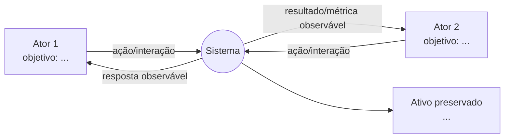
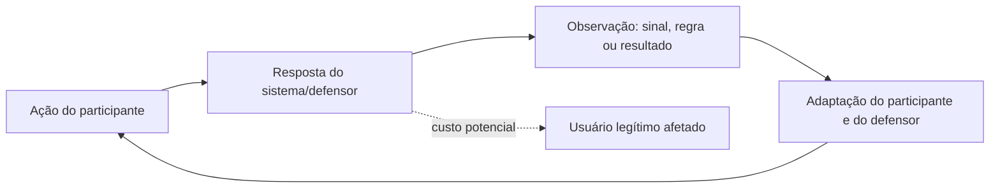
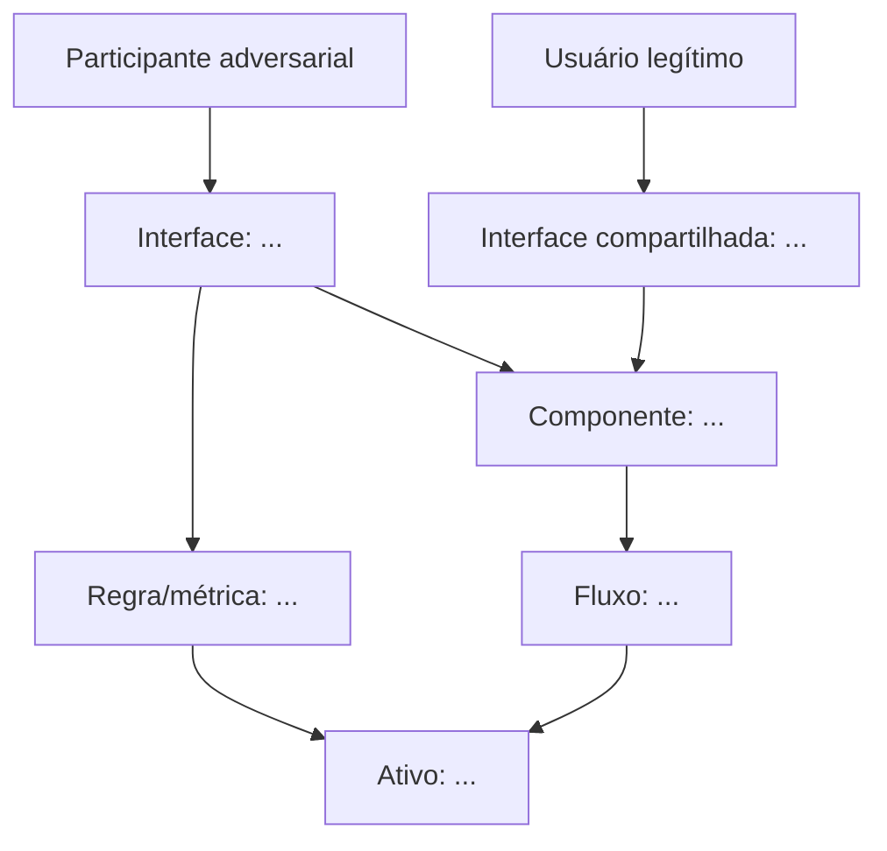

# Trabalho 1 — Análise de um Sistema Adversarial

## Identificação

- **Disciplina:** Engenharia de Software Adversarial
- **Data de entrega:** 06/10
- **Grupo:** Grupo 7
- **Integrantes:**
  - Rafael Barboza Torres (rafaelbarbozarafaelbarboza.aluno@unipampa.edu.br)
  - Elton Henrique Lunardi Gimenes (eltongimenes.aluno@unipampa.edu.br)
  - Frederico Marques da Silva Barcelos (fredericobarcelos.aluno@unipampa.edu.br)
  - Diego Santos de Araujo (diegoaraujo.aluno@unipampa.edu.br)

## Resumo do sistema

Este trabalho analisa o sistema Poker Adversarial, com foco na interação específica jogo de poker.

O sistema é adversarial porque contém diversos agentes e todos são adversários entre si, buscando ganhar o jogo. Os participantes observam as respostas do outro e da mesa e adaptam suas ações ao longo das rodadas.

> **Escopo:** a análise não cobre todo o domínio de jogos de cartas ou todas as regras do poker. Ela se limita a dois jogadores, uma mão, três rodadas de apostas, fichas virtuais e informações parcialmente ocultas. O sistema deverá registrar as ações, atualizar o pote, indicar as informações observáveis e permitir que cada jogador adapte sua estratégia com base nas ações anteriores.

## 1. Proposta e delimitação

### 1.1 Interação analisada

Descreva o fluxo escolhido do início ao fim:

1. Evento que inicia a interação:
O sistema inicia uma nova mão, distribui cartas privadas aos dois jogadores e define o jogador que agirá primeiro.

2. Ação do primeiro participante:
O Jogador A observa suas cartas e realiza uma ação: paga a aposta, aumenta a aposta, all win ou passa.

3. Resposta do sistema ou do outro participante:
O sistema atualiza o pote e informa a ação ao Jogador B. O Jogador B decide entre pagar, aumentar, desistir ou all win, com base em suas próprias cartas, na aposta observada e no comportamento anterior do Jogador A.

4. Resultado observado:
Os jogadores observam o valor do pote, o histórico de apostas, as cartas reveladas pelo dealer e se o adversário continua ou abandona a mão. Essas informações podem indicar força, fraqueza ou tentativa de blefe.

5. Decisão ou adaptação seguinte:
Na rodada seguinte, cada jogador adapta sua estratégia. O Jogador A pode aumentar a aposta para tentar representar uma mão forte, enquanto o Jogador B pode pagar, desistir, aumentar ou all win para testar o possível blefe. O sistema revela novas cartas (turn e river) e aplica novamente o ciclo de ação, resposta, observação e adaptação.

### 1.2 Por que é um sistema adversarial?

Explique por que o comportamento envolve decisões intencionais, objetivos conflitantes e adaptação a partir de respostas observáveis. Diferencie o caso de um simples erro ou acidente.

**Pergunta orientadora:** o que torna esse sistema adversarial, como os participantes tomam decisões e como a interação evolui ao longo das rodadas?

### 1.3 Escopo para o Trabalho 2

- **Funcionalidades incluídas:** [listar]
- **Funcionalidades excluídas:** [listar]
- **Atores implementáveis:** [listar]
- **Dados sintéticos ou ambiente próprio:** [descrever]
- **Premissas técnicas:** [listar]

## 2. Descrição do sistema adversarial

### 2.1 Atores, objetivos e capacidades

| Ator | Objetivo | Ações ou capacidades | Informações observáveis | Restrições ou custos |
|---|---|---|---|---|
| [Ator 1] | [objetivo] | [ações] | [informações] | [custos/restrições] |
| [Ator 2] | [objetivo] | [ações] | [informações] | [custos/restrições] |
| [Sistema/defensor] | [objetivo] | [ações] | [informações] | [custos/restrições] |

### 2.2 Ativo ou propriedade a preservar

O ativo ou propriedade principal a preservar é **[justiça, confiança, privacidade, disponibilidade, distribuição correta de um recurso etc.]**.

Explique:

- por que esse ativo é importante;
- como ele pode ser degradado;
- quais usuários legítimos podem ser afetados;
- como será possível observar ou medir sua preservação.

### 2.3 Pressupostos e possíveis falhas

| ID | Pressuposto do sistema | Como pode falhar | Consequência |
|---|---|---|---|
| P1 | [pressuposto] | [falha possível] | [consequência] |
| P2 | [pressuposto] | [falha possível] | [consequência] |
| P3 | [opcional] | [falha possível] | [consequência] |

### 2.4 Diagrama de contexto

O diagrama deve mostrar o sistema, os participantes e as principais interações. A versão editável também está em [`diagramas/contexto.mmd`](diagramas/contexto.mmd).

## 3. Modelo estratégico estático

### 3.1 Decisão central

A decisão analisada é **[descrever a decisão]**.

- **Jogador A:** [ator e objetivo]
- **Jogador B:** [ator e objetivo]
- **Ações de A:** A1 = [ação], A2 = [ação]
- **Ações de B:** B1 = [ação], B2 = [ação]
- **Convenção dos payoffs:** cada par é `(payoff de A, payoff de B)`; valores maiores representam maior preferência.

### 3.2 Matriz de payoffs

| Jogador A \\ Jogador B | B1: [ação] | B2: [ação] |
|---|---:|---:|
| **A1: [ação]** | **([A1B1], [A1B1])** | **([A1B2], [A1B2])** |
| **A2: [ação]** | **([A2B1], [A2B1])** | **([A2B2], [A2B2])** |

> Preencha com valores simples, preferencialmente de 0 a 3. Justifique cada valor com base nos objetivos, custos e benefícios dos jogadores.

### 3.3 Análise da matriz

#### Significado dos resultados

- **(A1, B1):** [explicação e justificativa dos payoffs]
- **(A1, B2):** [explicação e justificativa dos payoffs]
- **(A2, B1):** [explicação e justificativa dos payoffs]
- **(A2, B2):** [explicação e justificativa dos payoffs]

#### Melhores respostas

- Se B escolher B1, a melhor resposta de A é **[A1/A2]**, porque [justificativa].
- Se B escolher B2, a melhor resposta de A é **[A1/A2]**, porque [justificativa].
- Se A escolher A1, a melhor resposta de B é **[B1/B2]**, porque [justificativa].
- Se A escolher A2, a melhor resposta de B é **[B1/B2]**, porque [justificativa].

#### Estratégias dominantes e equilíbrio

- **Estratégia dominante de A:** [existe/não existe]. Justificativa: [texto].
- **Estratégia dominante de B:** [existe/não existe]. Justificativa: [texto].
- **Equilíbrio(s) de Nash:** [resultado(s), ou “não há equilíbrio em estratégias puras”].
- **Qualidade do equilíbrio para o sistema e usuários legítimos:** [análise].

Explique por que a melhor decisão de cada jogador depende, ou não, da escolha do outro participante.

## 4. Modelo estratégico dinâmico

### 4.1 Rodadas adversariais

| Rodada | Ação do participante | Resposta do sistema ou defensor | O que se torna observável? | Adaptação para a rodada seguinte |
|---|---|---|---|---|
| 1 | [ação] | [resposta] | [informação revelada] | [adaptação] |
| 2 | [ação] | [resposta] | [informação revelada] | [adaptação] |
| 3 | [ação] | [resposta] | [informação revelada] | [adaptação] |
| 4 — opcional | [ação] | [resposta] | [informação revelada] | [adaptação] |

As rodadas devem evidenciar o ciclo **ação → resposta → observação → adaptação**. Descreva como decisões passadas alteram as possibilidades seguintes e como uma defesa pode impor custos a usuários legítimos.

### 4.2 Diagrama do ciclo adaptativo

A versão editável está em [`diagramas/ciclo-adaptativo.mmd`](diagramas/ciclo-adaptativo.mmd).

### 4.3 Perguntas de fechamento

- **Quem observa quem?** [resposta]
- **O que cada lado consegue mudar?** [resposta]
- **O que dispara uma adaptação?** [resposta]
- **Qual é o custo da adaptação para cada lado?** [resposta]
- **Em que ponto pode surgir uma corrida armamentista?** [resposta]

## 5. Ameaças e riscos

### 5.1 Superfície de ataque

Liste interfaces, regras, componentes e fluxos exploráveis. A versão editável está em [`diagramas/superficie-de-ataque.mmd`](diagramas/superficie-de-ataque.mmd).

### 5.2 Cenários de ameaça

Use o formato: **Um [ator] pode realizar [ação] por meio de [ponto de exploração], aproveitando [fraqueza ou pressuposto], causando [impacto] sobre [ativo ou propriedade].**

| ID | Cenário de ameaça | Ponto de exploração | Pressuposto ou fraqueza | Ativo afetado | Probabilidade (1–3) | Impacto (1–3) | Risco |
|---|---|---|---|---|---:|---:|---:|
| A1 | Um [ator] pode [ação] por meio de [ponto], aproveitando [fraqueza], causando [impacto] sobre [ativo]. | [ponto] | [fraqueza] | [ativo] | [1–3] | [1–3] | [P × I] |
| A2 | Um [ator] pode [ação] por meio de [ponto], aproveitando [fraqueza], causando [impacto] sobre [ativo]. | [ponto] | [fraqueza] | [ativo] | [1–3] | [1–3] | [P × I] |
| A3 | Um [ator] pode [ação] por meio de [ponto], aproveitando [fraqueza], causando [impacto] sobre [ativo]. | [ponto] | [fraqueza] | [ativo] | [1–3] | [1–3] | [P × I] |

**Escala:** probabilidade: 1 = baixa, 2 = média, 3 = alta; impacto: 1 = baixo, 2 = médio, 3 = alto; risco = probabilidade × impacto.

### 5.3 Ameaça prioritária e resposta

- **Ameaça prioritária:** [ID e justificativa pela maior pontuação ou criticidade].
- **Resposta do sistema:** [controle ou mudança de regra].
- **Informação revelada pela resposta:** [sinal que o adversário consegue observar].
- **Adaptação provável na rodada seguinte:** [ação do adversário].
- **Efeitos colaterais para usuários legítimos:** [custos, falsos positivos, atraso etc.].
- **Risco residual:** [risco que permanece após a resposta].
- **Propriedade que continua sendo preservada:** [ativo/propriedade e como será monitorado].

## 6. Redesenho e resiliência

Proponha controles contextualizados, considerando incentivos e adaptação:

| Controle ou mudança | Ameaça tratada | Como altera incentivos | O que passa a ser observável | Custo/efeito colateral | Risco residual |
|---|---|---|---|---|---|
| [controle 1] | [A1/A2/A3] | [explicação] | [sinal] | [custo] | [risco] |
| [controle 2] | [A1/A2/A3] | [explicação] | [sinal] | [custo] | [risco] |

Explique por que a defesa é resiliente mesmo quando o adversário adapta seu comportamento. Não apresente uma defesa como solução definitiva sem analisar a reação seguinte.

## 7. Arquitetura inicial para o Trabalho 2

### 7.1 Componentes previstos

| Componente | Responsabilidade | Entradas | Saídas | Ameaças relacionadas |
|---|---|---|---|---|
| [componente] | [responsabilidade] | [entradas] | [saídas] | [IDs] |

### 7.2 Fluxo principal

Descreva o fluxo que deverá ser implementado no Trabalho 2, incluindo estados relevantes, regras, decisões e dados sintéticos necessários.

### 7.3 Critérios de sucesso

- [critério funcional]
- [critério de preservação do ativo]
- [critério de observabilidade]
- [critério de resposta/adaptação]

## 8. Referências

Consulte [`fontes/referencias.md`](fontes/referencias.md). Todas as fontes externas utilizadas devem ser citadas nesta seção e relacionadas às afirmações do relatório.

## 9. Declaração de uso de IA generativa

Ferramentas de IA generativa foram utilizadas para **[revisão estrutural, geração do esqueleto inicial, brainstorming, revisão textual etc.]**. O grupo verificou o conteúdo por meio de **[leitura das fontes, conferência dos conceitos, validação dos cálculos e discussão entre os integrantes]**. As decisões finais, exemplos, payoffs, ameaças e conclusões foram revisados e assumidos pelo grupo.

## 10. Contribuições individuais

| Integrante | Contribuições identificáveis |
|---|---|
| [Nome] | [seções, diagramas, referências, commits] |
| [Nome] | [seções, diagramas, referências, commits] |
| [Nome] | [seções, diagramas, referências, commits] |
| [Nome] | [seções, diagramas, referências, commits] |

## 11. Checklist antes da entrega

- [ ] Interação específica e bem delimitada.
- [ ] Atores, objetivos, ativos, capacidades, informações e pressupostos.
- [ ] Matriz de payoffs explicada.
- [ ] Melhores respostas, estratégias dominantes e equilíbrio(s) analisados.
- [ ] Pelo menos três rodadas de ação, resposta, observação e adaptação.
- [ ] Diagramas de contexto, superfície de ataque e ciclo adaptativo.
- [ ] Pelo menos três ameaças ligadas ao sistema analisado.
- [ ] Probabilidade, impacto e risco calculados.
- [ ] Resposta à ameaça prioritária, próxima adaptação e risco residual.
- [ ] Redesenho e resiliência analisados.
- [ ] Referências incluídas.
- [ ] Declaração de uso de IA incluída.
- [ ] Contribuições individuais identificáveis no histórico do Git.
- [ ] Apresentação em slides e vídeo preparados conforme as orientações.

## Pergunta final

Depois que o sistema responder, **o que o outro lado aprenderá e tentará fazer em seguida?**

[Responder com base no modelo dinâmico, na ameaça prioritária e na defesa proposta.]
